# TESTING checklist

In this section we provide a testing checklist that will be handled automatically in the next phase of this project. 
In particular, we will cover unit testing, integration testing and functional testing.

## Test 1
Home page of the Epithelial Modelling Platform presented below in `Figure 1`.

### Test 1.1
Click on the image icon to reload the `Figure 1`.

### Test 1.2
Slideshow component cycles through images (Carousel), as shown in `Figure 1`.

### Test 1.3
`Read more` links in the body section navigate to the associated page for detailed description (see `Figure 1`).
 
### Test 1.4
Links in the bottom header navigate to the associated page for detailed description (see `Figure 1`).

*Figure 1: home page of the Epithelial Modelling Platform.*

## Test 2
Click `MODEL DISCOVERY`, shown in `Figure 2`, to navigate to the `MODEL DISCOVERY` page.

*Figure 2: `MODEL DISCOVERY` option in the Epithelial Modelling Platform.*

### Test 2.1
`Figure 2.1` shows an empty search result for the initial instance.

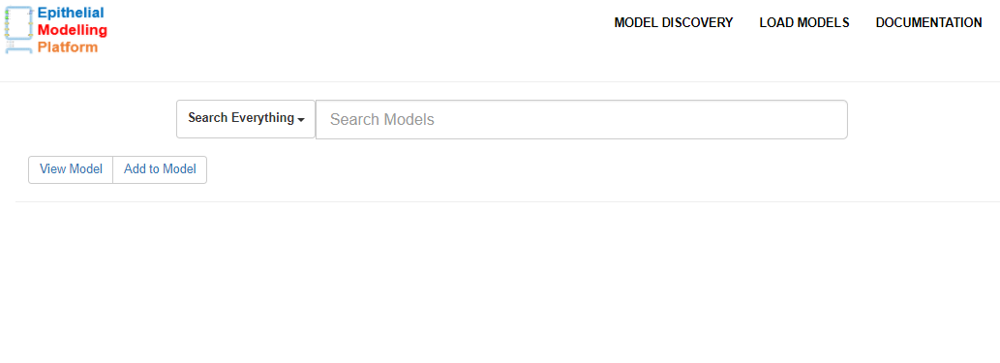
*Figure 2.1: empty search result in the `MODEL DISCOVERY` page.*

#### Test 2.1.1
Click `Search Everything` to see a set of filter terms from the search result. Initially search result is empty, therefore, `Filter by Protein` is empty, as shown in `Figure 2.1.1`.

*Figure 2.1.1: semantic filter in the `MODEL DISCOVERY` page.*

#### Test 2.1.2
Discover epithelial transport model for a search text -- `flux of sodium`. `Figure 2.1.2` illustrates the search result from the annotated information in PMR. 

*Figure 2.1.2: search result for `flux of sodium` in the `MODEL DISCOVERY` page.*

#### Test 2.1.2.1
Click `Add to Model`, shown in `Figure 2.1.2.1`, to make a short-list of models (similar to `Figure 3.1`) for considering these in the new epithelial model. 

*Figure 2.1.2.1: Add models in the `LOAD MODELS` page.*

#### Test 2.1.2.2
`Figure 2.1.2.2` shows detailed information of a selected model after clicking the `View Model` in `Figure 2.1.2.1`. 

*Figure 2.1.2.2: view detailed information of a selected model in the `VIEW` page.*

#### Test 2.1.2.2.1
Click `MODEL DISCOVERY` to discover more epithelial transport model. If this page is NOT empty, then previously discovered model(s) will appear.

#### Test 2.1.2.2.2
Click `LOAD MODELS` to see the short-listed models. If this page is NOT empty, then previously loaded model(s) will appear.

#### Test 2.1.2.2.3
Click `DOCUMENTATION` to get the documentation of this platform.

#### Test 2.1.3
All the proteins in the search result will appear in the `Filter by Protein`, as shown in `Figure 2.1.3`. Next, filter with `sodium/glucose cotransporter 1` to narrow down the search result.

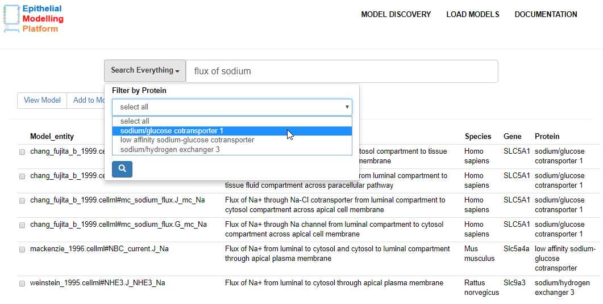
*Figure 2.1.3: filter with `sodium/glucose cotransporter 1` in the `MODEL DISCOVERY` page.*

##### Test 2.1.4
Presented below in `Figure 2.1.4` shows the search result after filtering with `sodium/glucose cotransporter 1` in `Figure 2.1.3`. 

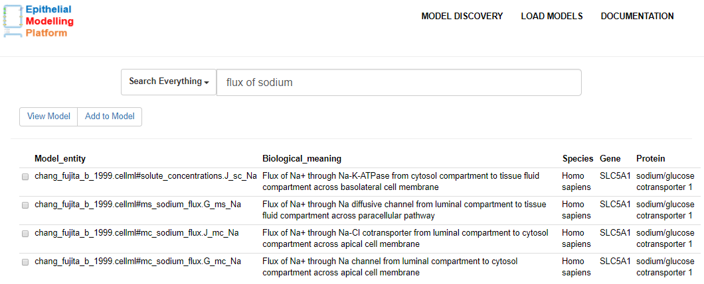
*Figure 2.1.4: search result after filtering with `sodium/glucose cotransporter 1` in the `MODEL DISCOVERY` page.*

### Test 2.2
Click `LOAD MODELS` to see the short-listed models. If this page is NOT empty, then previously loaded model(s) will appear.

### Test 2.3
Click `DOCUMENTATION` to get the documentation of this platform.

## Test 3
Click `LOAD MODELS` in `Figure 2` to get a short-listed model in order to design a new epithelial model. `Figure 3` shows an empty result as there is no loaded model. 

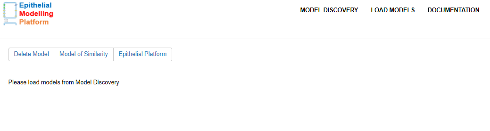
*Figure 3: empty result in the `LOAD MODELS` page.*

### Test 3.1
`Figure 3.1` shows short-listed models selected from the `MODEL DISCOVERY` page in `Figure 2.1.2`. This short-listed models will be considered in an epithelial platform for visualization and graphical editing. 

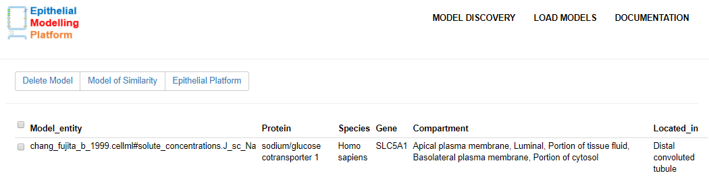
*Figure 3.1: selected model from the `MODEL DISCOVERY` page in Figure 2.1.2.*

### Test 3.2
Click `MODEL DISCOVERY` to discover more epithelial transport model. If this page is NOT empty, then previously discovered model(s) will appear.

### Test 3.3
Click `DOCUMENTATION` to get the documentation of this platform.

### Test 3.4
Click `Delete Model` to remove the selected model(s).

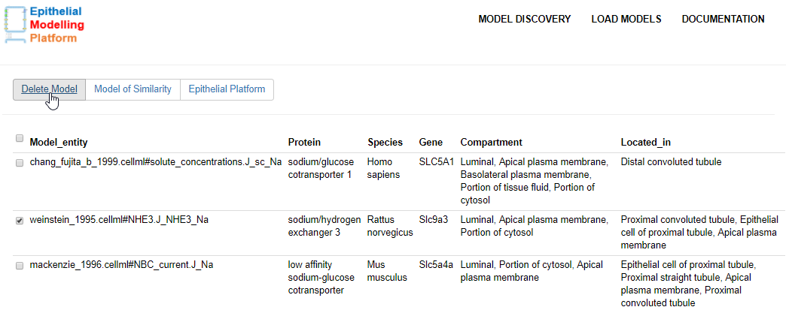
*Figure 3.4: delete model(s) in the `LOAD MODELS` page.*

### Test 3.5
Click `Model of Similarity` to find similarity between models.

### Test 3.6
Click `Epithelial Platform` to semantically display the short-listed models (from the `LOAD MODELS` page) in an epithelial modelling platform for visualization and graphical editing. 
If `LOAD MODELS` page is empty then only the skeleton of the platform will be visualized. 

## Test 4
Click `DOCUMENTATION` in `Figure 2` to get the documentation of this platform. A README link is provided for deatailed description of the Epithelial Platform's workflow, as shown in `Figure 4`.

*Figure 4: README link in the `DOCUMENTATION` page.*

### Test 4.1
`Figure 4.1` shows github's README after clicking the link in `Figure 4`.

*Figure 4.1: github's README after clicking the link in the `DOCUMENTATION` page.*

### Test 4.2
Click `MODEL DISCOVERY` to discover epithelial transport model. If this page is NOT empty, then previously discovered model(s) will appear.

### Test 4.3
Click `LOAD MODELS` to see the short-listed models. If this page is NOT empty, then previously loaded model(s) will appear.

## Test 5
Click `Model of Similarity` to find similarity between the selected models as shown in `Figure 5`.

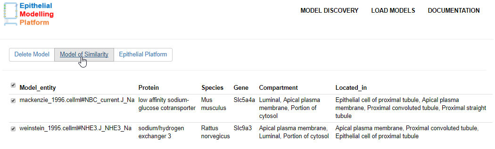
*Figure 5: find similarity between the selected models.*

### Test 5.1
Presented below in `Figure 5.1` visually distinguishes models' component with unique color.

*Figure 5.1: similarity between mackenzie and weinstein model.*

#### Test 5.1.2
Click `MODEL DISCOVERY` to discover epithelial transport model. If this page is NOT empty, then previously discovered model(s) will appear.

#### Test 5.1.3
Click `LOAD MODELS` to see the short-listed models. If this page is NOT empty, then previously loaded model(s) will appear.

#### Test 5.1.4
Click `DOCUMENTATION` to get the documentation of this platform.

### Test 5.2
Click `MODEL DISCOVERY` to discover epithelial transport model. If this page is NOT empty, then discovered loaded model(s) will appear.

### Test 5.3
Click `LOAD MODELS` to see the short-listed models. If this page is NOT empty, then previously loaded model(s) will appear.

### Test 5.4
Click `DOCUMENTATION` to get the documentation of this platform.

## Test 6
Click `Epithelial Platform` to semantically display the short-listed models, shown in `Figure 6`, in an epithelial modelling platform for visualization and graphical editing.
Verify that the models shown in `Figure 6` and `Figure 6.1` are identical.

*Figure 6: short-listed models for visualization and graphical editing in an epithelial modelling platform.*

### Test 6.1
Hover over the mouse on the `TSC` cotransporter represented as `circle` with a bidirectional arrow in `Figure 6.1` in order to get a `tooltip`.

#### Test 6.1.1
Click the `CellML` image to navigate to the associated CellML model.

#### Test 6.1.2
Click the `SEDML` image to navigate to the associated SEDML model.

#### Test 6.1.3
Click the `middle mouse` to close the `tooltip`.

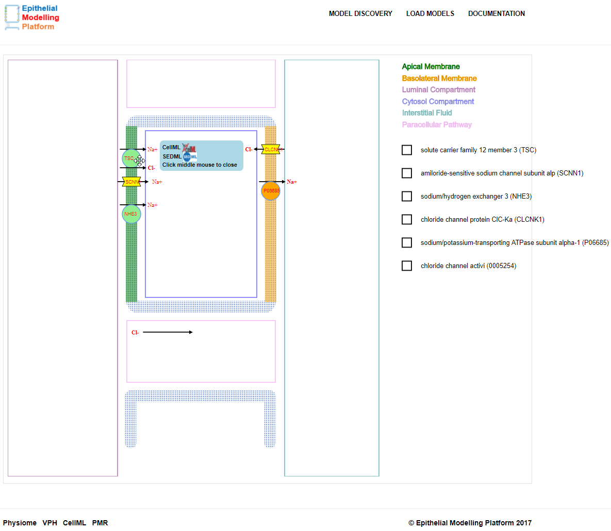
*Figure 6.1: hover over on a circle to display a tooltip in order to navigate to the associated CellML and SEDML model.*

## Test 7
Click a checkbox to enable the associated flux or channel `draggable` (see Figure 7`). We use the following symbols to represent fluxes and channels:
- `single fluxes` and `cotransporters` with `circles`
- `channels` with `polygons`
- `diffusive fluxes` in the paracellular pathway with a `text` and an `arrow`.

### Test 7.1
Drag and hover the `circle` over the basolateral membrane region and verify that membrane's color appear as `yellow` (see `Figure 7`).

### Test 7.2
Drop the `circle` on the basolateral membrane and make decision based on the information in the modal window.

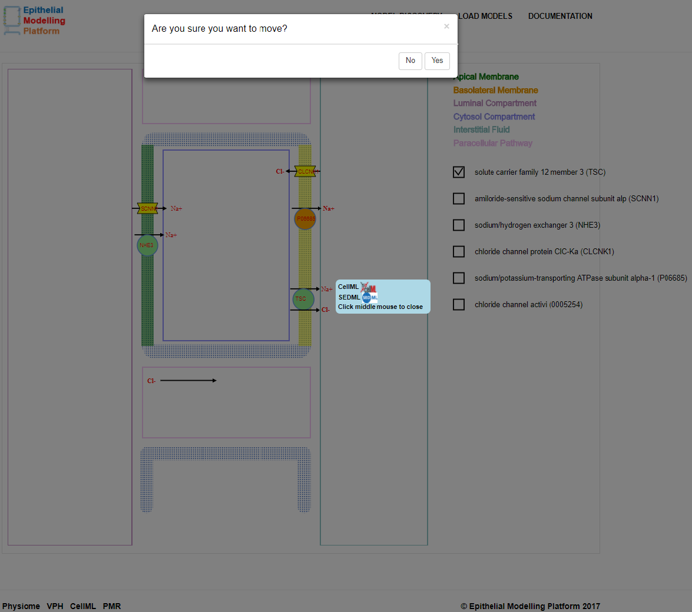
*Figure 7: Drop a circle on the basolateral membrane and make decision based on the information in the modal window.*

#### Test 7.2.1
If `No` is clicked in the modal window, then the `TSC` will return to its origin (see `Figure 6.1`).

#### Test 7.2.2
If `Yes` is clicked in the modal window, then the annotation of `TSC` model and some recommendations will appear (see `Figure 7.1`).

##### Test 7.2.2.1
A brief description of the dragged model. As can be seen in `Figure 7.1`, `sodium/glucose cotransporter 1` is a `Kidney` model. It is located in `distal convoluted tubule`.

##### Test 7.2.2.2
`Model:` -- name of the dragged CellML `model entity` (`TSC`) with the associated workspace URI (see `Figure 7.1` and the supplementary example in `Test 8` section below.) 

##### Test 7.2.2.3
`Biological Meaning:` -- annotation of the `TSC` cotransporter deposited in PMR (see `Figure 7.1` and the supplementary example in `Test 8` section below.)

##### Test 7.2.2.4
`Species:` -- name of the species (see `Figure 7.1` and the supplementary example in `Test 8` section below.)

##### Test 7.2.2.5
`Gene:` -- name of the gene (see `Figure 7.1` and the supplementary example in `Test 8` section below.)

##### Test 7.2.2.6
`Protein:` -- name of the protein model (see `Figure 7.1` and the supplementary example in `Test 8` section below.)

##### Test 7.2.2.7
`Basolateral membrane model` -- recommendations of the existing annotated basolateral membrane model in PMR. In this case, `Not Exist` because the modal window does not 
show already visualized model(s) in the apical and basolateral membrane. (see `Figure 7.1` and the supplementary example in `Test 8` section below.)

##### Test 7.2.2.8
`Alternative model of sodium/glucose cotransporter 1` (or other dragged model!) -- alternative recommendations on different species of the dragged model as well as from other workspaces (see `Figure 7.1` and the supplementary example in `Test 8` section below.)

##### Test 7.2.2.9
`Kidney` (or other organ!) model in PMR (see `Figure 7.1` and the supplementary example in `Test 8` section below.)

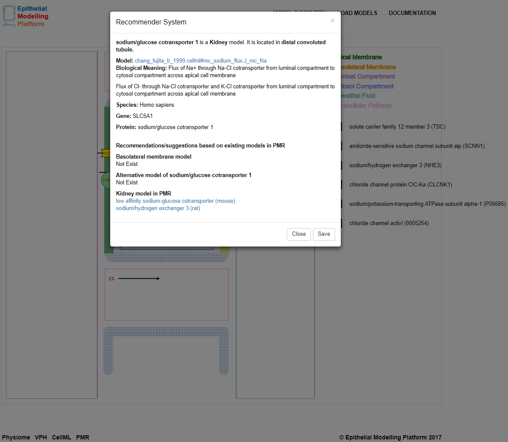
*Figure 7.1: Modal window (Recommender System) for providing some recommendations.*

## Test 8
A supplementary example on moving a circle from apical to basolateral membrane.

### Test 8.1
Drag and hover the `circle` over the apical membrane region and verify that membrane's color appear as `yellow` (see `Figure 8`).

### Test 8.2
Drop the `circle` on the apical membrane and make decision based on the information given in the modal window.

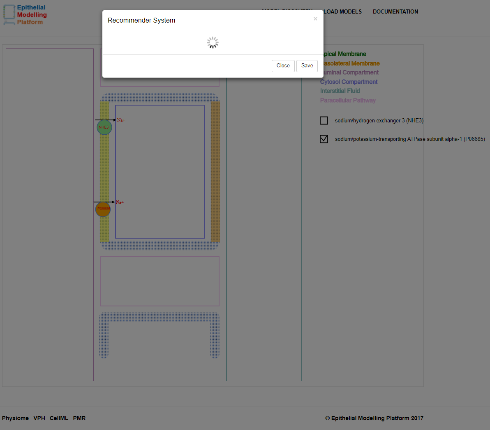
*Figure 8: Drag and drop `P06685` model from basolateral to apical membrane.*

#### Test 8.2.1
If `No` is clicked in the modal window, then the `P06685` will return to its origin position.

#### Test 8.2.2
If `Yes` is clicked in the modal window, then the annotation of `P06685` model and some recommendations will appear, illustrated in `Figure 8.1` and `Figure 8.1.1`.

*Figure 8.1: Modal window annotated information after moving `P06685` model from basolateral to apical membrane.*

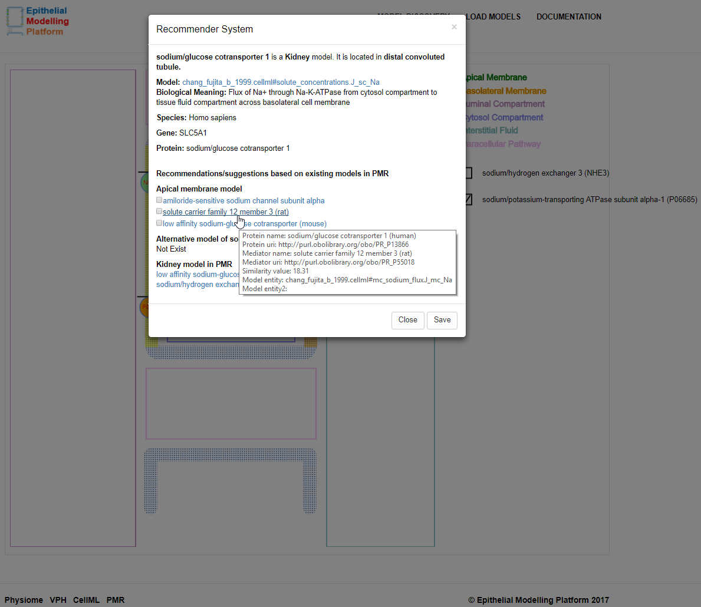
*Figure 8.1.1: Modal window annotated information after moving `P06685` model from basolateral to apical membrane.*

##### Test 8.2.2.1
A brief description of the dragged model (see `Figure 8.1` and `Figure 8.1.1`).

##### Test 8.2.2.2
`Model:` -- name of the dragged CellML `model entity` (`P06685`) with the associated workspace URI (see `Figure 8.1` and `Figure 8.1.1`) 

##### Test 8.2.2.3
`Biological Meaning:` -- annotation of the `P06685` cotransporter deposited in PMR (see `Figure 8.1` and `Figure 8.1.1`)

##### Test 8.2.2.4
`Species:` -- name of the species (see `Figure 8.1` and `Figure 8.1.1`)

##### Test 8.2.2.5
`Gene:` -- name of the gene (see `Figure 8.1` and `Figure 8.1.1`)

##### Test 8.2.2.6
`Protein:` -- name of the protein model (see `Figure 8.1` and `Figure 8.1.1`)

##### Test 8.2.2.7
`Apical membrane model` -- recommendations of the existing annotated basolateral membrane model in PMR (see `Figure 8.1` and `Figure 8.1.1`)

##### Test 8.2.2.8
`Alternative model of sodium/glucose cotransporter 1` (or other dragged model!) -- alternative recommendations of different species of the dragged model as well as from other workspaces (see `Figure 8.1` and `Figure 8.1.1`)

##### Test 8.2.2.9
`Kidney` (or other organ!) model in PMR (see `Figure 8.1` and `Figure 8.1.1`)

##### Test 8.2.2.10
Select a model from the modal window shown in `Figure 8.2` in order to replace with the dragged model (`P06685`) (see `Figure 8.2`)

*Figure 8.2: Select a model to replace with the `P06685` model.*

##### Test 8.2.2.11
Replaced `P06685` model with `TSC` (`P06685`). `Figure 8.3` illustrates updated circles position, as well as the checkbox region.
By doing so, we have replaced all the annotations of the dragged model with the replaced model.

*Figure 8.3: Replaced `P06685` model with `TSC`.*

#### Test 8.2.3.1
Click `MODEL DISCOVERY` to discover more epithelial transport model. If this page is NOT empty, then previously discovered model(s) will appear.

#### Test 8.2.3.2
Click `LOAD MODELS` to see the short-listed models. If this page is NOT empty, then previously loaded model(s) will appear.

#### Test 8.2.3.3
Click `DOCUMENTATION` to get the documentation of this platform.