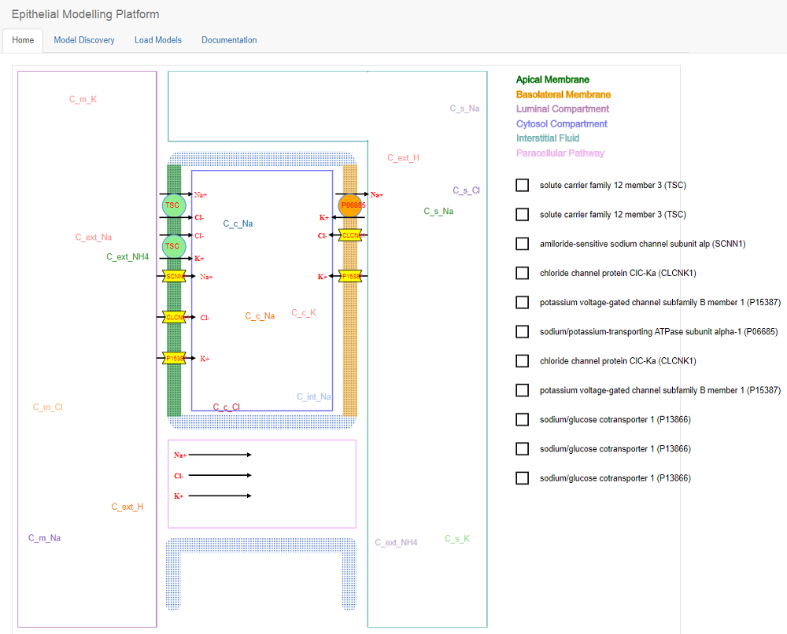

Modelling Platform
==================

This platform has been generated from the discovered  models in the “Load Models” page. 
Following screenshoot illustrates semantically generated models’ component as circles and 
polygons. This platform is comprised of two memebranes – apical and basolateral, and four 
compartments – luminal, cytosol, ineterstitial fluid, and paracellular pathway. Each of 
this has been depicted with a  unique color on the top right corner. 

According to the design, concentrations will be floating around on a specific 
compartment and the fluxes will be placed on a specific membrane based on the 
annotation. From the screenshot presented below, Na+ and Cl- are flowing from 
luminal to cytosol compartment across apical membrane and NaCl cotransporter. 
To make a distinction, fluxes and cotransporters have been represented with circles, 
and channels have been represenetd with polygons, where as diffusive fluxes in the 
paracellular pathway have been presented with a text followed by an arrow. On the right 
side, we have generated checkboxes for each of the fluxes. User can drag and drop existing 
fluxes on the opposite membrane. For example, user can drag and drop the NaCl cotransporeter 
on the basolateral membrane and afterwards this platform will render some useful suggestion 
which is discussed in the next section.    

